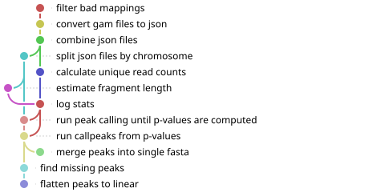

# Graph Peak Calling Snakemake Pipeline

This pipeline processes `.gam` files using **vg** and **graph-peak-caller** to call peaks on graph genomes, with an optional step to **flatten graph peaks onto a linear reference (BED output)**.

---

## Workflow Visualization



*Visualization generated with [snakevision](https://github.com/OpenOmics/snakevision)*

---

## Requirements
- Snakemake
- SLURM cluster
- `vg` executable (path set in `config/config.yaml`)
- `graph-peak-caller` available in the configured environment

---

## Configuration
Edit `config/config.yaml`:

- `input_dirs`: directories containing `.gam` files
- `vg_path`: path to the `vg` executable
- `graph_dir`: directory containing graph files (.vg, .xg, .gcsa, etc)
- `chromosomes`: list of chromosomes
- `gpc_env`: path to conda environment containing graph-peak-caller 

---

## Run pipeline (graph peaks only)

Run Snakemake from a *login* node (not a compute node and not via **sbatch**). Make sure your current working directory is the Snakemake project root. The `--jobs` flag is to limit the number of concurrent jobs running simultaneously. 
`
```bash
snakemake --profile profiles/slurm/
```
To run it via `nohup`:
```bash
nohup snakemake \
  --profile profiles/slurm/ \
  --rerun-incomplete \
  --keep-going \
  --jobs 10 \
  > snakemake.flatten.nohup.log 2>&1 &
disown
```
## Run pipeline with linear BED output (optional)

To run this step, make sure that your graph-peak-caller has been correctly modified.

```bash
snakemake --profile profiles/slurm/ --config flatten_beds=True
```
or via `nohup`:
```bash
nohup snakemake \
  --profile profiles/slurm/ \
  --config flatten_beds=True \
  --rerun-incomplete \
  --keep-going \
  --jobs 10 \
  > snakemake.flatten.nohup.log 2>&1 &
disown
```